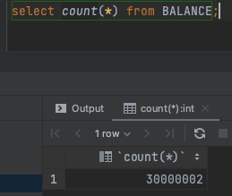
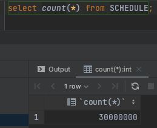
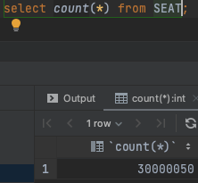
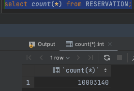

## index
### index란?
- 추가적인 쓰기 작업과 저장 공간을 활용하여 데이터베이스 테이블의 검색 속도를 향상시키기 위한 자료구조
### index를 사용하는 이유
- 테이블의 모든 데이터를 검색하면 시간이 오래 걸리기 때문에 데이터와 데이터의 위치를 포함한 자료구조를 생성하여 빠르게 조회할 수 있도록 한다.
- 인덱스를 활용하면 데이터를 조회하는 SELECT 외에도 UPDATE나 DELETE의 성능이 함께 향상된다. 그러한 이유는 해당 연산을 수행하려면 해당 대상을 조회해야만 작업을 할 수 있기 때문이다.
- 만약 index를 사용하지 않은 컬럼을 조회해야 하는 상황이라면 전체를 탐색하는 Full Scan을 수행해야 한다. Full Scan은 전체를 비교하여 탐색하기 때문에 처리 속도가 떨어진다.
### index의 단점
- 인덱스를 관리하기 위해 DB의 약 10%에 해당하는 저장 공간이 필요하다.
- 인덱스를 관리하기 위해 추가 작업이 필요하다.
- 인덱스를 잘못 사용할 경우 오히려 성능이 저하되는 역효과가 발생할 수 있다.

---

### index 적용 대상
- Balance - index(userId)
- Schedule - index(concertId, scheduleDate)
- Seat - index(scheduleId, seatStatus)
- Reservation - index(reservationExpiry, reservationStatus)

---

### index 선정 이유
1. Balance - index(userId)
- 사용자가 많아질 경우 데이터가 많아질 것으로 예상
- userId는 매우 높은 카디널리티를 가지고 있고, 인덱스를 적용함으로써 쿼리 실행 비용과 시간 모두 크게 개선되어 높은 성능 향상을 기대
- update가 빈번하고 update 시에도 조회를 하기 때문에 추가적인 성능 향상 기대
2. Schedule - index(concertId, scheduleDate)
- 한 콘서트가 가지는 예약 가능 일정은 그렇게 많지 않겠지만 전체 데이터가 많아지면 속도가 느려질 것이라 판단
- 콘서트가 많아질수록 적용 전과 후의 성능 차이가 더욱 유 의미하게 될 것이라 기대
3. Seat - index(shceduleId, seatStatus)
- 좌석 데이터의 경우 콘서트와 좌석 수에 따라 증가하기 때문에 총 데이터가 많을 것으로 예상
- 커버링 인덱스를 통해 높은 성능 향상 기대
4. Reservation - index(reservationExpiry, reservationStatus)
- 주기적으로 만료 처리를 하기 때문에 조회하는 데이터의 양은 적지만 예약 데이터는 계속 쌓여 조회 성능이 떨어질 것으로 예상

---

### 테스트 기준
- 총 데이터 3000만 건
###### Balance count

###### Schedule count

###### Seat count

###### Reservation count (1000만 건)

---

### 테스트 결과
#### 1. Balance - index(userId)
##### 사용 쿼리 findByUserId
###### 인덱스 적용 전
- -> Filter: (balance.USER_ID = 18)  (cost=3.08e+6 rows=2.97e+6) (actual time=1.22..10567 rows=1 loops=1)
  -> Table scan on BALANCE  (cost=3.08e+6 rows=29.7e+6) (actual time=1.22..9885 rows=30e+6 loops=1)
- 1,SIMPLE,BALANCE,,ALL,,,,,29693221,10,Using where
- 실제 수행 시간 12s404ms
###### user_id index 적용 후
- -> Index lookup on BALANCE using IDX_USER_ID (USER_ID=18)  (cost=1.09 rows=1) (actual time=0.849..0.852 rows=1 loops=1)
- 1,SIMPLE,BALANCE,,ref,IDX_USER_ID,IDX_USER_ID,9,const,1,100,null
- 실제 수행 시간 50ms
##### update(잔액 충전, 차감)
###### 인덱스 적용 전
- 1,UPDATE,BALANCE,,index,,PRIMARY,8,,29693221,100,Using where
- 실제 수행 시간 17s803ms
###### 인덱스 적용 후
- 1,UPDATE,BALANCE,,range,IDX_USER_ID,IDX_USER_ID,9,const,1,100,Using where
- 실제 수행 시간 44ms
#### 2. Schedule - index(concertId, scheduleDate)
##### 사용 쿼리 findByConcertIdAndScheduleDateAfter
###### index 적용 전
- -> Filter: ((`schedule`.CONCERT_ID = 1) and (`schedule`.SCHEDULE_DATE > <cache>(now())))  (cost=2.82e+6 rows=971746) (actual time=0.858..8716 rows=2 loops=1)
  -> Table scan on SCHEDULE  (cost=2.82e+6 rows=29.2e+6) (actual time=0.179..7961 rows=30e+6 loops=1)
- 1,SIMPLE,SCHEDULE,,ALL,,,,,29155288,3.33,Using where
- 실제 수행 시간 6s694ms
###### concertId 단일 index 적용 후
- -> Filter: (`schedule`.SCHEDULE_DATE > <cache>(now()))  (cost=2.07 rows=0.667) (actual time=0.0564..0.0603 rows=2 loops=1)
  -> Index lookup on SCHEDULE using IDX_SCHEDULE_CONCERTID (CONCERT_ID=1)  (cost=2.07 rows=2) (actual time=0.0446..0.0479 rows=2 loops=1)
- 1,SIMPLE,SCHEDULE,,ref,IDX_SCHEDULE_CONCERTID,IDX_SCHEDULE_CONCERTID,9,const,2,33.33,Using where
- 실제 수행 시간 65ms
###### concertId, scheduleDate 복합 index 적용 후
- -> Index range scan on SCHEDULE using IDX_SCHEDULE_CONCERTID_SCHEDULEDATE over (CONCERT_ID = 1 AND '2024-08-07 08:56:22.000000' < SCHEDULE_DATE), with index condition: ((`schedule`.CONCERT_ID = 1) and (`schedule`.SCHEDULE_DATE > <cache>(now())))  (cost=3.23 rows=2) (actual time=0.0325..0.04 rows=2 loops=1)
- 1,SIMPLE,SCHEDULE,,range,IDX_SCHEDULE_CONCERTID_SCHEDULEDATE,IDX_SCHEDULE_CONCERTID_SCHEDULEDATE,18,,2,100,Using index condition
- 실제 수행 시간 48ms
#### 3. Seat - index(scheduleId, seatStatus)
##### 사용 쿼리 findByScheduleIdAndSeatStatus
###### index 적용 전
- -> Filter: ((seat.SCHEDULE_ID = 1) and (seat.SEAT_STATUS = 1))  (cost=3.09e+6 rows=299037) (actual time=6.74..10580 rows=50 loops=1)
  -> Table scan on SEAT  (cost=3.09e+6 rows=29.9e+6) (actual time=6.73..9849 rows=30e+6 loops=1)
- 1,SIMPLE,SEAT,,ALL,,,,,29903700,1,Using where
- 실제 수행 시간 10s532ms
###### scheduleId 단일 index 적용 후
- -> Filter: (seat.SEAT_STATUS = 1)  (cost=50.5 rows=5) (actual time=0.934..0.954 rows=50 loops=1)
  -> Index lookup on SEAT using IDX_SEAT_SCHEDULEID (SCHEDULE_ID=1)  (cost=50.5 rows=50) (actual time=0.93..0.942 rows=50 loops=1)
- 1,SIMPLE,SEAT,,ref,IDX_SEAT_SCHEDULEID,IDX_SEAT_SCHEDULEID,9,const,50,10,Using where
- 실제 수행 시간 73ms
###### scheduleId, seatStatus 복합 index 적용 후
- -> Index lookup on SEAT using IDX_SEAT_SCHEDULEID_SEATSTATUS (SCHEDULE_ID=1), with index condition: (seat.SEAT_STATUS = 1)  (cost=50.5 rows=50) (actual time=0.816..0.829 rows=50 loops=1)
- 1,SIMPLE,SEAT,,ref,IDX_SEAT_SCHEDULEID_SEATSTATUS,IDX_SEAT_SCHEDULEID_SEATSTATUS,9,const,50,10,Using index condition
- 실제 수행 시간 60ms
#### 4. Reservation - index(reservationExpiry, reservationStatus)
##### 사용 쿼리 findAllByReservationStatusAndReservationExpiryBefore
###### index 적용 전
- -> Filter: ((reservation.RESERVATION_STATUS = 2) and (reservation.RESERVATION_EXPIRY > <cache>(now())))  (cost=991339 rows=331148) (actual time=8.44..6336 rows=1 loops=1)
  -> Table scan on RESERVATION  (cost=991339 rows=9.94e+6) (actual time=3..5923 rows=10e+6 loops=1)
- 1,SIMPLE,RESERVATION,,ALL,,,,,9935429,3.33,Using where
- 실제 수행 시간 4s645ms
###### reservationStatus 단일 index 적용 후
- -> Filter: ((reservation.RESERVATION_STATUS = 2) and (reservation.RESERVATION_EXPIRY > <cache>(now())))  (cost=996359 rows=331148) (actual time=2.62..4518 rows=1 loops=1)
  -> Table scan on RESERVATION  (cost=996359 rows=9.94e+6) (actual time=2.57..4153 rows=10e+6 loops=1)
- 1,SIMPLE,RESERVATION,,ALL,IDX_RESERVATION_RESERVATIONSTATUS,,,,9935429,3.33,Using where
- 실제 수행 시간 6s450ms
###### reservationExpiry 단일 index 적용 후
- -> Filter: (reservation.RESERVATION_STATUS = 2)  (cost=2.21 rows=0.1) (actual time=2.57..2.57 rows=1 loops=1)
  -> Index range scan on RESERVATION using IDX_RESERVATION_RESERVATIONEXPIRY over ('2024-08-07 19:20:40.000000' < RESERVATION_EXPIRY), with index condition: (reservation.RESERVATION_EXPIRY > <cache>(now()))  (cost=2.21 rows=1) (actual time=2.56..2.57 rows=1 loops=1)
- 1,SIMPLE,RESERVATION,,range,IDX_RESERVATION_RESERVATIONEXPIRY,IDX_RESERVATION_RESERVATIONEXPIRY,9,,1,10,Using index condition; Using where
- 실제 수행 시간 156ms
###### reservationExpiry, reservationStatus 복합 Index 적용 후
- -> Index range scan on RESERVATION using IDX_RESERVATION_RESERVATIONEXPIRY_RESERVATIONSTATUS over ('2024-08-07 17:06:25.000000' < RESERVATION_EXPIRY), with index condition: ((reservation.RESERVATION_EXPIRY > <cache>(now())) and (reservation.RESERVATION_STATUS = 2))  (cost=2.21 rows=1) (actual time=10.8..10.8 rows=1 loops=1)
- 1,SIMPLE,RESERVATION,,range,IDX_RESERVATION_RESERVATIONEXPIRY_RESERVATIONSTATUS,IDX_RESERVATION_RESERVATIONEXPIRY_RESERVATIONSTATUS,9,,1,10,Using index condition
- 실제 수행 시간 52ms

---

### 의견
1. Balance
- 기대 했던 것처럼 index 적용 전 후의 성능이 매우 많은 차이가 발생했고, 데이터가 많아질수록 더욱 큰 차이가 날 것이라 예상
- update 시에도 추가적인 성능 향상 효과 발생
2. Schedule
- where절의 조건 컬럼이 2개이기 때문에 단일 인덱스는 추가적인 filter 작업을 거쳐서 복합 인덱스 보다 성능이 저하되기 때문에 복합 인덱스 채택
3. Seat
- update가 빈번하지만 데이터도 많고 사용자의 조회가 잦고 속도가 중요하다고 생각하여 index를 적용하기에 적합
- seatStatus의 경우 카디널리티가 낮아 복합키를 사용할 시에 scheduleId의 순서를 앞에 두어야 index의 성능 향상 효과를 기대할 수 있음
4. Reservation
- 조회되는 데이터의 양은 적을 것으로 예상되지만 예약 데이터가 쌓일수록 성능이 떨어져 index를 적용하여 해당 문제 해결
- reservationStatus는 카디널리티가 낮아 복합키를 사용할 시에 reservationExpiry의 순서를 앞에 두어야 index의 성능 향상 효과를 기대할 수 있음