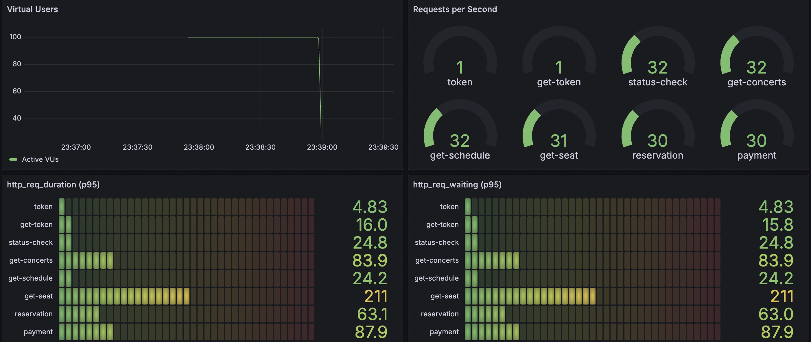
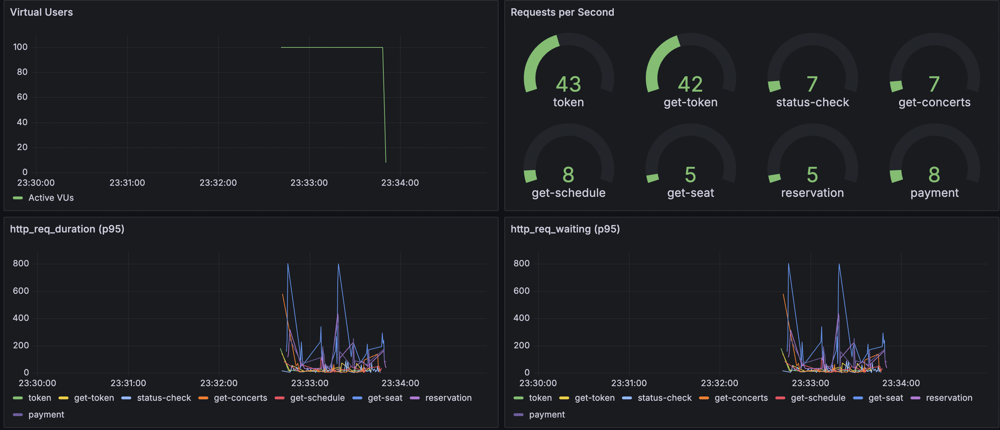
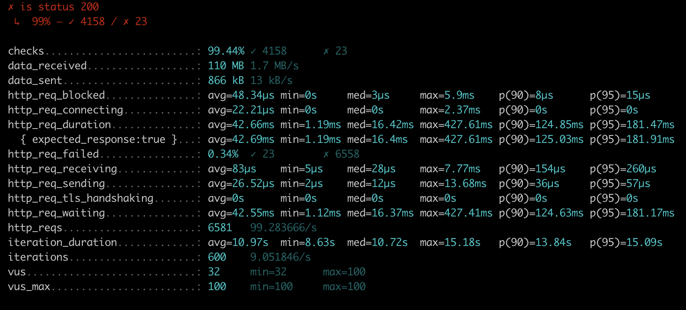
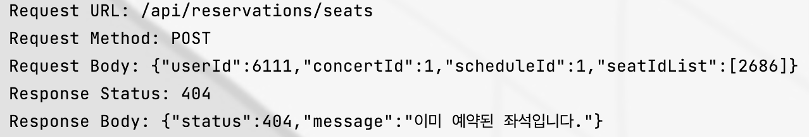
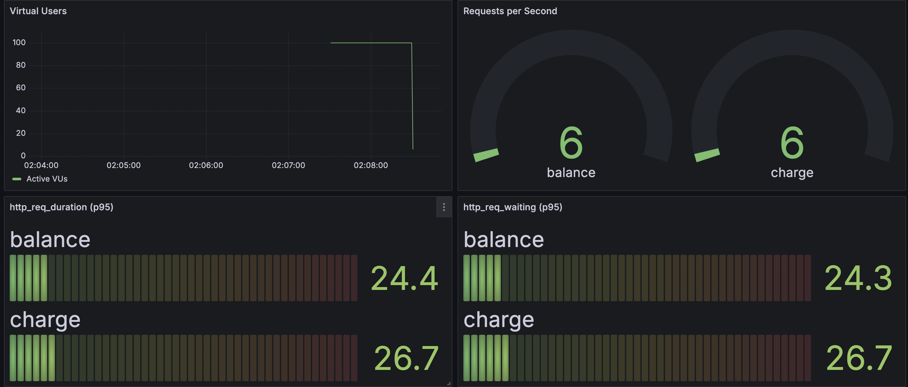
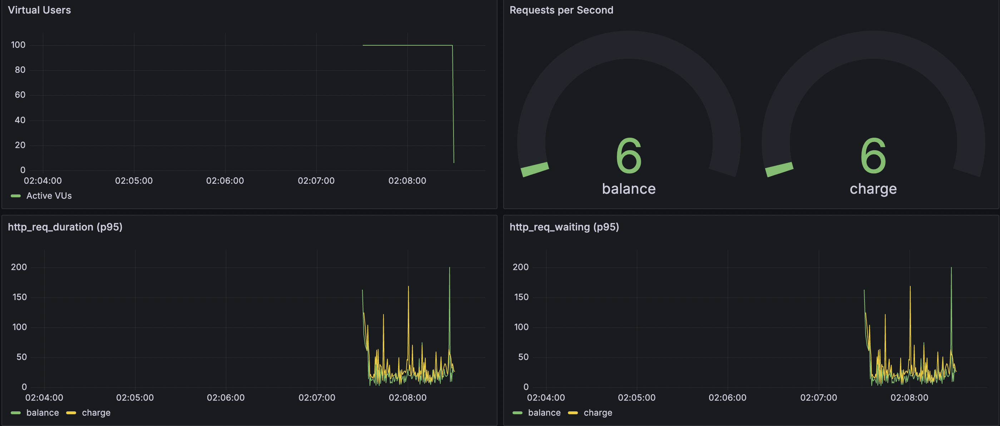
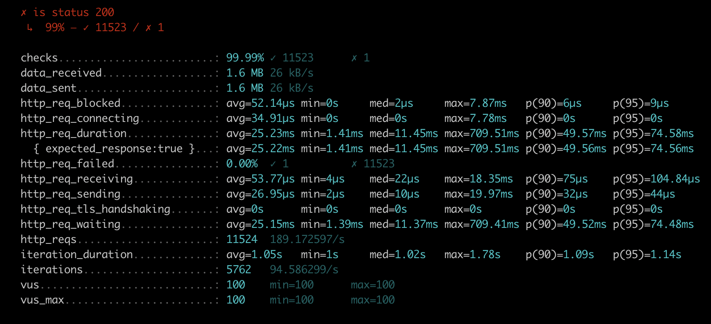

## 장애 대응 및 부하 테스트
~~~
해당 테스트는 MSA 환경으로 서비스 및 DB가 분산 되어 있다고 가정한다.
해당 테스트는 실제 서버 환경이 구축 되어 있다고 가정한다.
테스트 도구로는 K6를 사용한다.
모니터링 도구로는 grafana + influxDB를 사용한다.
~~~
### 부하 테스트의 목적
1. 성능의 한계 측정 - 트래픽 제어 범위 예측
2. 병목지점 - 성능 저하 기능 발굴 
3. 효율적인 비용 책정 - 배포 스팩 책정
4. 장애 대비 - 이벤트 또는 트래픽이 급증 했을 경우 문제 지점 파악

---

### 성능 테스트
#### 목적
- 서비스의 기본적 안정성 측정을 위함
#### 대상 API
~~~
유저 대기열 토큰 발급 API
POST /api/token

유저 대기열 토큰 조회 API
GET /api/token/{userId}

유저 잔액 충전 API
PUT /api/balance/charge

유저 잔액 조회 API
GET /api/balance/{userId}

콘서트 조회 API
GET /api/concerts

예약 가능 일정 조회 API
GET /api/concerts/schedules/{concertId}

해당 일정 예약 가능 좌석 조회 API
GET /api/concerts/seats/{scheduleId}

좌석 예약 요청 API
POST /api/reservations/seats

결제 API
POST /api/reservations/payments
~~~

### 첫 번째 시나리오 (대기열 발급 ~ 결제)
##### 목표
- tps 100 ~ 200을 기준으로 한다.
- 부하가 걸리는 API 추출
- 문제 분석
- 해결 방안 도출
##### 대상 API
~~~
유저 대기열 활성 확인 API (시나리오 테스트용 임시 API)
GET /api/token/status/{userId}

유저 대기열 토큰 발급 API
POST /api/token

유저 대기열 토큰 조회 API
GET /api/token/{userId}

콘서트 조회 API
GET /api/concerts

예약 가능 일정 조회 API
GET /api/concerts/schedules/{concertId}

해당 일정 예약 가능 좌석 조회 API
GET /api/concerts/seats/{scheduleId}

좌석 예약 요청 API
POST /api/reservations/seats

결제 API
POST /api/reservations/payments
~~~
##### 사용 스크립트 (k6 - javascript)
```
import http from 'k6/http';
import {check, sleep} from 'k6';
import {randomIntBetween, randomItem} from 'https://jslib.k6.io/k6-utils/1.2.0/index.js';

export let options = {
    scenarios: {
        concert_scenario: {
            vus: 100, // 가상 사용자
            exec: 'concert_scenario',
            executor: 'constant-vus',
            // iterations: 1,
            duration: '1m'
        }
    }
};

export function concert_scenario() {

    let userId = randomIntBetween(1, 10000);

    token(userId) // 토큰 발급 및 조회

    waitForActive(userId);

    getConcert(userId); // 콘서트 조회
    sleep(1);
    getSchedule(userId); // 일정 조회
    sleep(1.5);
    let seatId = getSeat(userId); // 좌석 조회
    sleep(1);
    seatReservation(userId, seatId); // 좌석 예약

}

function token(userId) {
    let tokenRequest = { userId: userId };
    let tokenRes = http.post(
        'http://localhost:8080/api/token',
        JSON.stringify(tokenRequest),
        {
            headers: { 'Content-Type': 'application/json' },
            tags: { name: 'token' }
        }
    );
    check(tokenRes, { 'is status 200': (r) => r.status === 200 });
    sleep(1);
    getToken(userId);
}

function getToken(userId) {
    let getTokenRes = http.get(
        `http://localhost:8080/api/token/${userId}`,
        {
            tags: { name: 'get-token' }
        }
    );
    check(getTokenRes, { 'is status 200': (r) => r.status === 200 });
}

function waitForActive(userId) {
    let isActive = false;

    while (!isActive) {
        let statusRes = http.get(
            `http://localhost:8080/api/token/status/${userId}`,
            {
                tags: { name: 'status-check' }
            }
        );

        if (statusRes.status === 200 && statusRes.body === 'true') {
            isActive = true;
        } else {
            sleep(2);
        }
    }
}


function getConcert(userId) {
    let concertRes = http.get(
        'http://localhost:8080/api/concerts',
        {
            tags: { name: 'get-concerts' },
            headers: { 'userId': userId }
        }
    );
    check(concertRes, { 'is status 200': (r) => r.status === 200 });
}

function getSchedule(userId) {
    let concertId = 1;
    let scheduleRes = http.get(
        `http://localhost:8080/api/concerts/schedules/${concertId}`,
        {
            tags: { name: 'get-schedule' },
            headers: { 'userId': userId }
        }
    );
    check(scheduleRes, { 'is status 200': (r) => r.status === 200 });
}

function getSeat(userId) {
    let scheduleId = 3;
    let seatRes = http.get(
        `http://localhost:8080/api/concerts/seats/${scheduleId}`,
        {
            tags: { name: 'get-seat' },
            headers: { 'userId': userId }
        }
    );
    check(seatRes, { 'is status 200': (r) => r.status === 200 });
    let randomSeat = randomItem(seatRes.json())['seatId'];

    return randomSeat;
}

function seatReservation(userId, seatId) {
    let seatIdList = [seatId];
    let concertId = 1;
    let scheduleId = 1;
    let reservationRequest = {
        userId: userId,
        concertId: concertId,
        scheduleId: scheduleId,
        seatIdList: seatIdList
    };
    let reservationRes = http.post(
        'http://localhost:8080/api/reservations/seats',
        JSON.stringify(reservationRequest),
        {
            headers: { 'Content-Type': 'application/json', 'userId': userId },
            tags: { name: 'reservation' }
        }
    );
    check(reservationRes, { 'is status 200': (r) => r.status === 200 });
    let reservationId = reservationRes.json()['reservationId'];
    if (reservationRes.status === 200) {
        payment(userId, reservationId); // 결제
    } 
}

function payment(userId, reservationId) {
    let amount = 60000;
    let paymentRequest = {
        userId: userId,
        reservationId: reservationId,
        amount: amount
    };
    let paymentRes = http.post(
        'http://localhost:8080/api/reservations/payments',
        JSON.stringify(paymentRequest),
        {
            headers: { 'Content-Type': 'application/json', 'userId': userId },
            tags: { name: 'payment' }
        }
    );
    check(paymentRes, { 'is status 200': (r) => r.status === 200 });
}
```

##### 결과
###### grafana1

###### grafana2

###### k6

###### log


##### 문제
- 예약 가능 좌석 조회 부하 
- 1% 요청 실패

##### 분석
- index를 걸었음에도 1000만 건의 조회가 이루어져 조회 성능이 많이 저하됨
- 좌석 예약 동시성 이슈 발생 - 요청 실패가 아닌 이미 예약된 좌석에 대한 의도된 에러 

##### 해결 방안
- 예약 가능 좌석의 페이징 처리를 통해 해결

### 두 번째 시나리오 (잔액 조회 ~ 충전)
##### 목표
- tps 100 ~ 200을 기준으로 한다.
- p95 기준으로 레이턴시 평균 50ms 이하를 보장한다.
- p95 기준으로 duration 100ms 이하를 보장한다.

##### 대상 API
~~~
유저 잔액 충전 API
PUT /api/balance/charge

유저 잔액 조회 API
GET /api/balance/{userId}
~~~

##### 사용 스크립트 (k6 - javascript)
```
import http from 'k6/http';
import {check, sleep} from 'k6';
import {randomIntBetween, randomItem} from 'https://jslib.k6.io/k6-utils/1.2.0/index.js';

export let options = {
    scenarios: {
        balance_scenario: {
            vus: 100, // 가상 사용자
            exec: 'balance_scenario',
            executor: 'constant-vus',
            // iterations: 1,
            duration: '1m'
        }
    }
};

export function balance_scenario() {

    let userId = randomIntBetween(20, 1000);

    getBalance(userId);
}

function getBalance(userId) {
    let getBalanceRes = http.get(
        `http://localhost:8080/api/balance/${userId}`,
        {
            tags: { name: 'balance'}
        }
    );
    check(getBalanceRes, { 'is status 200': (r) => r.status === 200 });
    let amount = getBalanceRes.json()['amount'];
    if (getBalanceRes.status === 200) {
        sleep(1);
        chargeBalance(userId, amount); // 결제
    }
}

function chargeBalance(userId, amount) {
    amount += 6000;
    let chargeRequest = {
        userId: userId,
        amount: amount
    }
    let chargeBalanceRes = http.put(
        'http://localhost:8080/api/balance/charge',
        JSON.stringify(chargeRequest),
        {
            headers: { 'Content-Type': 'application/json' },
            tags: { name: 'charge' }
        }
    )
    check(chargeBalanceRes, { 'is status 200': (r) => r.status === 200 });
}
```
##### 결과
###### grafana1

###### grafana2

###### k6

- 191 TPS
- p95 기준 레이턴시 balance - 24.3ms charge - 24.4ms
- p95 기준 duration balane - 24.4ms charge - 26.7ms

---

### 장애 대응
- 장애가 발생할 수 있는 시나리오 예측 및 장애 발생 후 재발 방지
- 문제 해결 방안 도출

#### 예약 가능 좌석 조회 API
##### 장애 원인
- 부하테스트 과정에서 값이 자주 바뀌는 좌석에 대한 캐싱으로 인해 빈번한 에러 발생 및 index를 적용 하였음에도 조회되는 대량의 데이터에 부하 발생
##### 장애 시간
- 부하테스트 진행 중 (약 10분)
##### 재발 방지책
- 좌석에 대한 캐싱 제거
- 좌석 조회에 대한 페이징처리 추가

#### 결제 API
##### 장애 포인트
- PG사 장애
##### 장애 방지책
- PG사 외부 API 호출에 대한 서킷 브레이커 적용
- Resilience4j 라이브러리 half-open 방식 사용
- 서킷 브레이커 이벤트를 통한 상태 변화 모니터링 -> 시스템의 복구 상태 확인
- 장애 발생 시 즉각 확인 가능한 모니터링 시스템 적용 - 숏텀