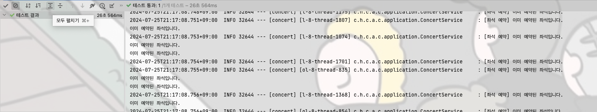

## 좌석 예약
##### 좌석예약 복합 유니크키 테스트

### 좌석예약 DB 복합 유니크키를 사용한 동시성 이슈 해결
해당 방안은 동시성 이슈를 Lock을 사용하지 않고 잡긴 했지만 DB의 write 요청이 계속 들어와서 DB에 부하를 줍니다 하지만 대기열을 통해 쓰기 부하를 제어 했기 때문에 사용할 수 있는 방법이라고 판단했습니다.
하지만 예약이 취소 되었을 때 좌석예약 데이터를 날려버려야 하기 때문에 예약이 취소된 좌석에 대해서 데이터가 손실 되기 때문에 채택하긴 어렵다고 생각합니다.

##### 좌석예약 낙관적 락 10명 테스트

##### 좌석예약 낙관적 락 100명 테스트

### 좌석예약 낙관적 락을 이용한 동시성 이슈 해결
낙관적 락의 경우 좌석예약은 1명만 성공하고 나머지는 fail 시키면 되어서 retry가 필요 없다는 점
이미 대기열로 부하를 컨트롤 하였기 때문에 한 좌석에 대한 충돌 리스크가 크지 않다는 점을 고려 해봤을 때 비관적 락보다 적합하다고 판단하였습니다. 하지만 1명이 성공한 이후에도 신청이 들어온 수 만큼 쓰기 부하를 가져간다는 것이 아쉽습니다. 많은 부하가 들어오면 DB write에 부하가 걸리기 때문에 DB write에 아에 접근하지 못하게 분산락으로 인스턴스의 동시성을 막아야 한다고 생각합니다. 하지만 이 방법 또한 대기열에서 부하를 막기 위한 절차를 밟았기 때문에 분산락을 사용할 수 없는 환경에서 채택 가능성이 있다고 생각합니다.

##### 좌석예약 비관적 락 10명 테스트

##### 좌석예약 비관적 락 100명 테스트

##### 좌석예약 비관적 락 3000명 테스트

### 좌석예약 비관적 락을 이용한 동시성 이슈 해결
인스턴스 10개와 100개의 기준으로 테스트를 해본 결과 낙관적 락보다 테스트 속도가 빠르게 나왔지만 쿼리 방식에 따른 차이라고 생각하고 1명만 요청에 성공하면 되고, 대기열로 이미 제한을 걸어둔 상태에서 비관적 락보다 낙관적 락이 적합하다고 생각합니다. 테스트의 속도가 더 빨랐다곤 하지만 낙관적 락을 사용하기에 적합한 상황에서 테스트의 속도가 빠르다는 이유 하나로 락 자체를 걸지 않는 낙관적 락보다 비관적 락이 더 성능이 좋다고 판단할 수 없다고 생각했습니다.
만약 비관적 락을 사용한다면 다른 방법들과 마찬가지로 DB write를 계속 사용하고 어차피 한 좌석에 한 명만 배정 받을 수 있다고는 해도
적절한 타임아웃으로 락 대기로 인한 성능 저하를 최소화 시킬 수 있을 것 같습니다.

##### 좌석예약 redis 분산락 10명 테스트

##### 좌석예약 redis 분산락 100명 테스트

### 좌석 예약 redis simple lock을 이용한 동시성 이슈 해결
TransactionHandler를 만들어서 Lock을 먼저 획득하고 본 비즈니스 메서드를 호출하는 식으로 해보았습니다.
테스트 시에 다른 락에 비해 성능이 크게 좋다거나 하는 것은 못 느꼈지만 log를 찍어본 결과 낙관, 비관 락은 Transaction을 계속 잡아 먹는데 분산 락은 Transaction을 1번만 잡았습니다. 3000개로 테스트를 하니 설정한 Timeout 시간에 걸려 실패 했지만 적절한 시간 조절과 서버의 성능만 따라준다면,, 확실히 낙관, 비관과는 비교도 할 수 없이 좋을 것 같다고 생각해서 좌석 예약의 경우 분산락으로 채택하였습니다.
지금은 대기열의 허용 인구가 적지만 이후에 대기열의 허용 인구가 많아 진다고 생각 했을 때 좌석의 부하도 심할 것이고 그렇다면 낙관락에서 비관락으로 가야 한다고 생각하는데 비관락으로 처리 하는 것 보다는 분산락이 훨씬 효과적이라고 생각합니다. 1좌석만 예약하고 나머지는 fail 시켜야 하기에 spin lock 방식과 pub/sub 방식은 적합하지 않다고 생각하여 simple lock으로 적용하였습니다.
---
## 잔액 충전 / 차감
##### 잔액 충전 낙관적 락 테스트

##### 결제 잔액 차감 낙관적 락 테스트

### 잔액 충전, 사용 낙관적 락을 이용한 동시성 이슈 해결
최초 1회 성공 후에 나머지 요청들은 retry 하지 않고 바로 예외를 던지게 하였습니다.
잔액의 경우 사용자가 악의적으로 여러번 충전한다고 생각되지 않아 동시 요청은 1번만 성공하는게 맞다고 판단하였습니다. 충돌 가능성이 적고, retry가 필요 없다는 점을 고려하여 비관적 락보다 적합하다고 판단하였습니다.

##### 잔액 충전 비관적 락 테스트

##### 결제 잔액 차감 비관적 락 테스트

### 잔액 충전, 사용 비관적 락을 이용한 동시성 이슈 해결
비관적 락을 사용한 경우 10번 요청하면 10번 요청 모두 처리가 되고 1번만 성공하도록 막으려면 조회 쿼리를 한 번 더 던져야 해서 잔액 충전, 사용에 있어서 낙관적 락보다 이점이 없다고 생각해서 채택하진 않았습니다.
하지만 상황에 따라 이 방법또한 채택 가능성이 있다고 생각합니다. 그러나 저는 동시 따닥에 대해 1번의 요청만 처리하도록 방향을 잡았기 때문에 낙관적 락이 더 적합한 것 같다고 판단했습니다.