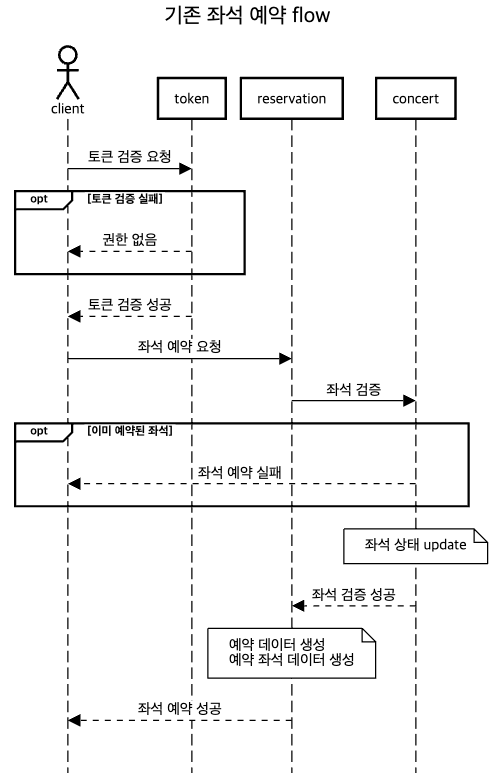
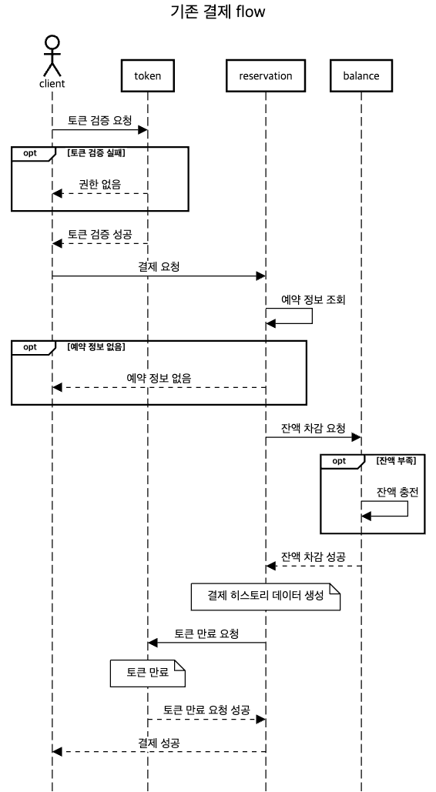
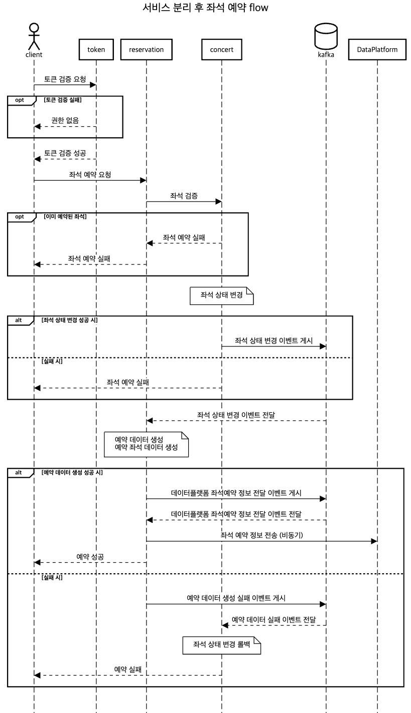
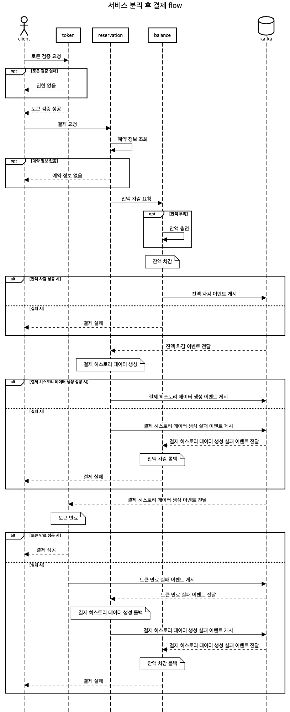

## MSA 보고서
### MicroService Architecture란?
- 소프트웨어 시스템을 여러 작은 독립적인 서비스로 분할하여 개발하고 배포하는 방식
- 하나의 Application을 구분 가능한 여러 개의 작은 서비스로 나눠 사용자의 요청을 처리하는 구조
### 장점
- 개발 유연성의 한계 극복
- 요구사항 처리 시 모놀리틱 시스템 대비 빠른 대처 가능
- 배포/롤백 리스크의 획기적 감소
- 장애 격리의 신뢰성
- 리소스의 효율적 사용

---

### 현재 서비스 구조
- Monolithic Architecture
- balance / concert / reservation / token 도메인 별 레이어드 4계층

---

### 서비스 규모 확장에 따른 MSA
- 서비스가 확장됨에 따라 모놀리식 아키텍처의 단일 Application 구조는 점점 더 특정 서비스의 독립적인 확장, 배포, 유지보수가 어려워질 수 있음
- MSA로 전환하게 되면 각 도메인을 별도의 서비스로 분리하여 관리하여 각 서비스는 독립적으로 배포되고, 필요에 따라 별도로 확장 가능

---

### 분리된 트랜잭션에 대한 문제
- MSA로 전환 시, 이전에는 하나의 트랜잭션으로 처리되던 작업이 여러 개의 독립된 서비스로 분리되고 이로 인해 분산 트랜잭션 문제 발생, 데이터 일관성을 보장하기 어려워짐
- 다른 두 서비스가 각각 독립된 데이터베이스를 사용한다면 트랜잭션 관리가 복잡해지고 중간에 네트워크 장애나 하나의 서비스가 실패할 경우 데이터 불일치가 발생할 수 있음

---

### 해결 방안
#### Saga 패턴
- 분산 시스템에서 장기 실행 트랜잭션을 관리하기 위한 디자인 패턴
- 각 트랜잭션이 여러 서비스로 분리되어 있을 때, 각 서비스는 독립적으로 작업을 수행하고, 만약 어느 하나의 서비스에서 오류가 발생하면 이전에 성공한 서비스의 작업을 롤백하는 보상 트랜잭션을 실행하여 전체 시스템의 일관성을 유지
###### 코레오그래피(Choreography)
- 각 서비스가 다른 서비스에게 필요한 후속 작업을 직접 호출하는 방식
- 서비스 간의 상호작용이 직접적이며 중앙 조정자가 필요 없음
###### 오케스트레이션(Orchestration)
- 중앙 조정자가 각 서비스의 작업을 관리
- 작업 실패 시 보상 작업을 명령하는 방식
#### Kafka + Saga 패턴
- Kafka를 활용한 Saga는 보통 코레오그래피 방식을 따르며 Kafka를 통해 서비스간의 이벤트를 전달
- 각 서비스는 자신이 수행한 작업의 성공 또는 실패를 나타내는 이벤트를 Kafka 토픽에 게시
- 각 서비스는 Kafka 토픽에서 메시지를 소비하고 자신이 처리해야 할 작업을 수행한 후 그 결과를 다시 Kafka 토픽에 게시
- 한 서비스에서 작업이 실패하면 실패한 작업과 연관된 보상 트랜잭션을 트리거 // 보상 트랜잭션도 Kafka 토픽에 게시되며 이를 통해 다른 서비스가 이전 작업을 롤백

---

### 서비스 분리 전

##### 좌석 예약 flow

##### 결제 flow

---

### 서비스 분리 후

##### 좌석 예약 flow

##### 결제 flow

---

### 의견
- 분산 트랜잭션 환경으로 변경하면서 복잡도는 올라갔지만 MSA의 장점들을 가져가면서 Kafka+Saga 패턴으로   
데이터의 일관성을 유지하면서 트랜잭션 관리가 가능해져 유의미한 변화를 기대
- 처음 아키텍처 설계 단계부터 MSA를 생각하고 도메인 별로 분리한 구조를 설계했기 때문에 서비스 분리 작업 원활