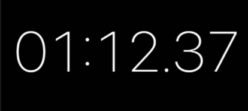

## 대기열 보고서
### 대기열은 왜 필요한가?
- 트래픽이 몰릴 경우 서버와 Slave DB는 스케일 아웃이 가능하지만  
  Master DB는 스케일 아웃이 안되기 때문에 한 번에 많은 인원이 쓰기 부하를 줘   
  Master DB가 죽는 상황을 방지하기 위함

---

### 대기열 전략
1. 은행창구 방식
- 인원수 제한을 두고 빠진 인원만큼 입장 시키는 방식
- 유저를 항상 일정 수 이하로 유지해 서비스가 안정감이 생김
- 유저에 따라 대기열의 전환시간이 불규칙하고 빠지는 인원이 없으면 대기 하는 유저들이 너무 많이 대기하게됨
2. 놀이공원 방식
- N초마다 M명씩 입장시키는 방식
- 서비스를 이용하는 유저의 수가 보장될 수 없다
- 대기중인 유저들에게 서비스 진입 가능 시간을 대체로 보장할 수 있다

---

### 놀이공원 방식 대기열 채택 이유
- 먼저 입장한 유저에게 우선권을 주기 위함이 아닌 트래픽이 몰려서 Master DB에 부하를 주는 것을   
  막기 위함이 목적이기 때문에 놀이공원 방식 채택

---

### 기존 DB 대기열 -> Redis 대기열 이관
- 기존의 DB로 이루어진 대기열은 계속해서 DB를 사용하기 때문에   
  DB에 부하를 주지 않는 Redis를 사용한 대기열이 적합하다고 판단

---

### 놀이공원 방식 설계
- 초당 1000TPS 라고 가정
- 한 유저가 모든 서비스를 이용하고 나오는데 평균 약 1분 30초    
  
- 분당 40000TPS 허용
- (콘서트 조회 API, 일정 조회 API, 좌석 조회 API, 예약 API, 결제 API)5 * 1.5 (동시성 이슈에 의해 예약에 실패 하는 케이스를 위한 재시도 계수) = 7.5
  5개의 API를 조회 후 좌석 예약에 실패 하고 3번 씩이나 좌석을 예약할 수 있을 확률은 적다고 생각 (내림) -> 7
- 분당 처리할 수 있는 동시 접속자 수 = 5714 (40000 / 7)
- 10초 마다 952 명씩 유효한 토큰으로 전환 (5714 / 6)
- 나의 대기열 순번이 93283번 이라면 잔여 예상 대기시간은?
- 93283 / 952 * 10 = 979 = 16분 33초

---

### 의견
- 놀이공원 방식의 경우 서비스를 이용하는 유저의 수가 보장될 수 없다는 단점이 있지만   
  N 초마다 입장을 허용하되, 최대 허용치 기준을 두고 입장을 막는다면 단점을 보완할 수 있다고 생각합니다.